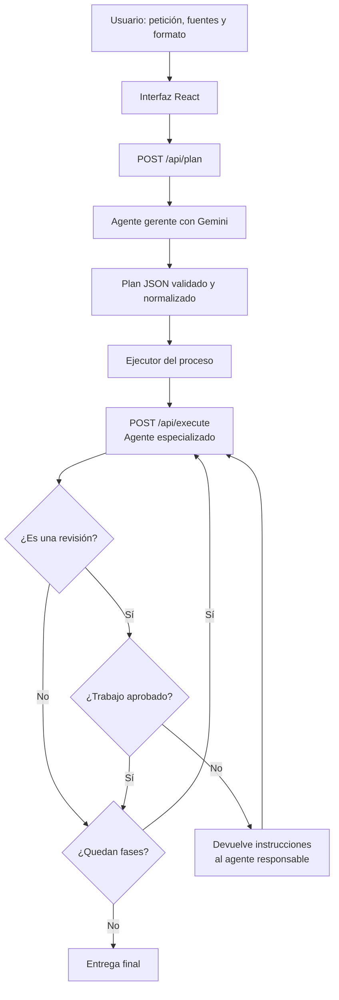

# Nexo Research

**Una red de agentes de IA que convierte una petición en un proceso de trabajo
planificado, ejecutado, revisado y corregido automáticamente.**

[Abrir Nexo Research](https://create-react-app-henar2004s-projects.vercel.app/)
·
[Ver el código en GitHub](https://github.com/henar2004/create-react-app)

> La aplicación está desplegada en Vercel. Si la protección de despliegues está
> activada, Vercel solicitará iniciar sesión antes de mostrarla.

## ¿Qué es Nexo Research?

Nexo Research es una prueba de concepto funcional de un sistema multiagente. El
usuario no tiene que escoger manualmente qué agentes utilizar ni diseñar el flujo:
solo describe lo que necesita, añade material de referencia si lo tiene y elige el
tipo de entrega.

Un **agente gerente** analiza la petición y construye un equipo temporal con los
especialistas necesarios. También decide:

- qué agentes deben participar;
- qué tarea concreta recibe cada agente;
- en qué orden se ejecutan las fases;
- de qué resultados depende cada fase;
- qué criterios debe cumplir cada resultado;
- qué fases necesitan una revisión;
- a qué agente debe regresar el trabajo si una revisión lo rechaza.

El objetivo del proyecto no es presentar seis chatbots aislados. Es demostrar que
un único modelo puede adoptar varios roles especializados y colaborar mediante un
flujo dinámico, con contexto compartido, dependencias y rutas de corrección.

## Prueba la aplicación

### Web

[**Ir a la aplicación desplegada**](https://create-react-app-henar2004s-projects.vercel.app/)

### Uso básico

1. Escribe una misión con al menos 10 caracteres.
2. Selecciona el tipo de resultado: resumen, informe, artículo u otro formato.
3. Añade fuentes o material de referencia si la tarea lo necesita.
4. Pulsa **Crear misión**.
5. Observa cómo el gerente selecciona el equipo y crea el proceso.
6. Abre cualquier fase para consultar su tarea, criterios, estado, intentos y
   resultado.
7. Cuando todas las fases terminan, copia la entrega desde **Resultado final**.

El botón **Cargar ejemplo completo** introduce una misión de demostración
aleatoria. Puede pulsarse varias veces para conocer distintos casos de uso.

## Cómo funciona



El flujo real de una misión es el siguiente:

1. El navegador envía la petición a `/api/plan`.
2. Gemini actúa como gerente y propone un plan estructurado de entre 2 y 5 fases.
3. El servidor valida el JSON, limita los agentes permitidos, corrige dependencias
   inválidas y garantiza que el último paso produzca una entrega utilizable.
4. La interfaz ejecuta las fases declaradas y llama a `/api/execute` para cada una.
5. Cada llamada utiliza la instrucción de sistema del agente seleccionado y recibe
   el contexto generado por las fases de las que depende.
6. Los agentes revisores pueden aprobar el trabajo o devolver cambios concretos.
7. Si hay un rechazo y quedan intentos, se repite la fase responsable con esas
   correcciones y después se ejecuta nuevamente la revisión.
8. El último resultado aprobado se presenta como entrega final.

Aunque el plan representa dependencias entre fases, la versión actual las ejecuta
en el orden declarado. La ejecución paralela de ramas independientes queda como
una posible ampliación futura.

## El equipo de agentes

Los agentes **no son modelos diferentes**. Todos utilizan la misma API y el mismo
modelo de Gemini, pero reciben instrucciones de sistema, objetivos y reglas
distintas para simular responsabilidades especializadas.

| Agente | Responsabilidad |
| --- | --- |
| **Gerente** | Interpreta la petición, selecciona entre 2 y 5 fases y diseña dependencias y rutas de corrección. |
| **Investigador** | Extrae hechos, fechas, contexto, evidencias y vacíos del material recibido. |
| **Analista** | Compara perspectivas, separa hechos de opiniones y detecta patrones, contradicciones o sesgos. |
| **Verificador** | Comprueba el respaldo factual y aprueba o devuelve el trabajo con cambios obligatorios. |
| **Redactor** | Convierte los resultados anteriores en la pieza solicitada, respetando formato, tono y extensión. |
| **Editor** | Revisa claridad, estructura y cumplimiento de requisitos; puede corregir o rechazar la entrega. |
| **Sintetizador** | Combina varios resultados aprobados y elimina repeticiones para crear la entrega final. |

El gerente selecciona únicamente los roles necesarios. Una misión sencilla no
utiliza todo el equipo, mientras que una tarea con investigación, contraste,
redacción y control de calidad puede requerir más especialistas.

## Revisiones y rutas de corrección

El **Verificador** y el **Editor** son agentes revisores. Su respuesta utiliza una
estructura JSON con:

- estado de aprobación;
- puntuación de 0 a 100;
- diagnóstico;
- problemas detectados;
- cambios obligatorios;
- texto final aprobado o corregido.

Cuando un revisor rechaza una fase, el plan indica `onRejectStep`, es decir, el
paso anterior al que debe volver el trabajo. El agente responsable recibe los
comentarios del revisor, prepara una nueva versión y la revisión se repite.

Cada fase admite uno o dos intentos, según lo decidido por el gerente y validado
por el servidor. Esto impide ciclos infinitos y mantiene controlado el consumo de
la API.

## Qué muestra la interfaz

- formulario guiado para la misión, el formato y las fuentes;
- ejemplos completos y aleatorios;
- estado de conexión con Gemini;
- catálogo de agentes y selección visual del equipo activo;
- resumen del plan creado por el gerente;
- número de fases, agentes elegidos y rutas de corrección;
- flujo de ejecución y estado de cada paso;
- inspector con tarea, criterios, intentos, revisión y resultado;
- entrega final lista para copiar;
- enlaces directos a la aplicación y al repositorio.

## Tecnologías

| Capa | Tecnología |
| --- | --- |
| Interfaz | React 18, Create React App y CSS |
| Backend | Vercel Functions sobre Node.js |
| Inteligencia artificial | Gemini API |
| Modelo predeterminado | `gemini-3.5-flash` |
| Formato del gerente y revisores | JSON estructurado mediante esquemas |
| Comunicación | `fetch` y endpoints HTTP |
| Desarrollo y despliegue | Vercel CLI y Vercel |
| Pruebas | React Testing Library y Jest |

La integración con Gemini utiliza el endpoint de interacciones de Google. El
modelo puede sustituirse mediante `GEMINI_MODEL` sin cambiar el código.

## Arquitectura del proyecto

```text
.
├── api/
│   ├── health.js          # Comprueba la configuración de Gemini
│   ├── plan.js            # Ejecuta al gerente y genera el plan
│   ├── execute.js         # Ejecuta una fase con el agente seleccionado
│   └── _lib/
│       ├── agents.js      # Roles, instrucciones y reglas del gerente
│       ├── gemini.js      # Cliente de la API de Gemini
│       ├── plan.js        # Normalización y límites del plan
│       └── schemas.js     # Esquemas JSON del plan y las revisiones
├── public/
│   ├── favicon.svg
│   ├── index.html
│   └── manifest.json
├── src/
│   ├── App.js             # Interfaz y orquestador del flujo
│   ├── App.css            # Diseño de componentes
│   ├── index.css          # Estilos globales
│   ├── index.js           # Entrada de React
│   └── App.test.js        # Prueba principal de la interfaz
├── .env.example
├── package.json
└── README.md
```

### Endpoints

| Método | Ruta | Función |
| --- | --- | --- |
| `GET` | `/api/health` | Indica si existe una clave y qué modelo está configurado. |
| `POST` | `/api/plan` | Recibe la misión y devuelve el plan validado del gerente. |
| `POST` | `/api/execute` | Ejecuta una fase con su agente, contexto y posibles correcciones. |

## Seguridad y validación

La clave de Gemini solo se utiliza en las funciones de `api/`. Nunca se incluye
en el JavaScript enviado al navegador.

- `.env.local` está excluido de Git mediante `.gitignore`.
- La variable se llama `GEMINI_API_KEY`, sin el prefijo `REACT_APP_`.
- El servidor consulta primero `process.env` y utiliza `.env.local` como respaldo
  durante el desarrollo local.
- El catálogo de agentes está cerrado a los seis roles conocidos.
- El plan se limita a un máximo de cinco fases.
- Las dependencias solo pueden apuntar a fases anteriores.
- Los textos, fuentes, contexto, criterios e intentos tienen límites.
- Las entradas del usuario se delimitan como datos y no pueden modificar las
  instrucciones de sistema.

No subas nunca `.env.local`, una clave real ni capturas que muestren credenciales.
En producción, la clave debe guardarse en las variables de entorno de Vercel.

## Instalación local

### Requisitos

- Node.js 22 o 24 LTS;
- npm;
- Vercel CLI;
- una clave de Gemini creada en
  [Google AI Studio](https://aistudio.google.com/app/apikey).

### 1. Clonar el repositorio

```bash
git clone https://github.com/henar2004/create-react-app.git
cd create-react-app
```

### 2. Instalar las dependencias

```bash
npm install
```

### 3. Instalar o actualizar Vercel CLI

```bash
npm install -g vercel@latest
```

Si no quieres instalarla globalmente, también puedes utilizar:

```bash
npx vercel@latest dev
```

### 4. Configurar Gemini

Copia `.env.example` como `.env.local`:

```env
GEMINI_API_KEY=tu_clave_de_google_ai_studio
GEMINI_MODEL=gemini-3.5-flash
```

`GEMINI_MODEL` es opcional. Si se omite, se utiliza `gemini-3.5-flash`.

### 5. Iniciar el proyecto

```bash
vercel dev
```

La aplicación estará disponible en
[http://localhost:3000](http://localhost:3000).

Es importante utilizar `vercel dev`: `npm start` solo inicia la interfaz de Create
React App, mientras que esta aplicación también necesita las funciones de
`api/` para proteger la clave y comunicarse con Gemini.

## Variables de entorno en Vercel

Para que el despliegue funcione, configura como mínimo:

| Variable | Obligatoria | Descripción |
| --- | --- | --- |
| `GEMINI_API_KEY` | Sí | Credencial privada de Google AI Studio. |
| `GEMINI_MODEL` | No | Modelo de Gemini que utilizarán todos los roles. |

Las variables pueden añadirse desde
[Environment Variables del proyecto](https://vercel.com/henar2004s-projects/create-react-app/settings/environment-variables).
Después de cambiarlas es necesario crear un nuevo despliegue para que la versión
publicada reciba los nuevos valores.

## Comandos disponibles

```bash
# Entorno completo: React y funciones de Vercel
vercel dev

# Solo el servidor de desarrollo de React
npm start

# Ejecutar las pruebas una vez
npm test -- --watchAll=false

# Crear la versión optimizada en la carpeta build/
npm run build
```

`npm run build` no inicia un servidor ni publica la web. Genera los archivos
optimizados que utilizará el despliegue de producción.

## Despliegue

El repositorio está conectado con Vercel. Los cambios enviados a la rama de
producción pueden generar un nuevo despliegue automáticamente.

También puede desplegarse manualmente:

```bash
vercel
```

Para publicar directamente en producción:

```bash
vercel --prod
```

Enlaces del proyecto:

- [Aplicación](https://create-react-app-henar2004s-projects.vercel.app/)
- [Repositorio](https://github.com/henar2004/create-react-app)
- [Panel de Vercel](https://vercel.com/henar2004s-projects/create-react-app)

## Consumo y límites

Una misión realiza más de una petición a Gemini:

- una llamada para que el gerente cree el plan;
- una llamada por cada fase ejecutada;
- hasta dos llamadas adicionales cuando una revisión provoca una corrección y una
  nueva comprobación.

Por tanto, una misión con más agentes también consume más cuota y tarda más. Los
límites gratuitos, precios y modelos disponibles dependen de la cuenta y de las
condiciones vigentes de Google AI Studio.

## Limitaciones actuales

- Todos los roles comparten un único modelo; son especializaciones por
  instrucciones, no inteligencias independientes.
- El Investigador trabaja con la petición y las fuentes proporcionadas. La
  aplicación no incluye búsqueda web, navegación ni recuperación automática de
  fuentes.
- Las fases se ejecutan secuencialmente aunque el plan pueda expresar ramas sin
  dependencias entre sí.
- La orquestación ocurre en el navegador; cerrar o recargar la pestaña interrumpe
  la misión en curso.
- No existe base de datos, historial persistente, cuentas de usuario ni
  colaboración entre usuarios.
- Los resultados dependen de la calidad de la petición, las fuentes y el modelo.
- Los esquemas y revisiones reducen errores, pero no garantizan que toda respuesta
  de IA sea correcta.
- La API está sujeta a límites de cuota, disponibilidad y posibles costes del
  proveedor.

## Solución de problemas

### “Gemini aún no está conectado”

Comprueba que `.env.local` se encuentre en la raíz, que contenga
`GEMINI_API_KEY` y que hayas reiniciado completamente `vercel dev`.

### `UV_HANDLE_CLOSING` en Windows

Si la misión termina correctamente pero la terminal muestra:

```text
Assertion failed: !(handle->flags & UV_HANDLE_CLOSING)
```

el mensaje procede del cierre interno de funciones locales de Node/libuv en
`vercel dev`, no de la lógica de los agentes. Actualiza Vercel CLI, reinicia el
servidor y vuelve a probar:

```bash
npm install -g vercel@latest
vercel dev
```

### El puerto 3000 ya está ocupado

Cierra el servidor anterior con `Ctrl+C` antes de iniciar otro. Si la web sigue
respondiendo, comprueba que no quede otro proceso de Node activo.

### La web desplegada solicita iniciar sesión

El proyecto tiene activada la protección de despliegues de Vercel. Para permitir
acceso público, revisa la configuración de **Deployment Protection** del proyecto.

## Estado del proyecto

Nexo Research es un prototipo funcional y demostrable de orquestación multiagente.
Su propósito principal es enseñar cómo un gerente puede formar equipos diferentes,
distribuir trabajo, transmitir contexto, aplicar controles de calidad y reconectar
fases cuando un resultado no es válido.
