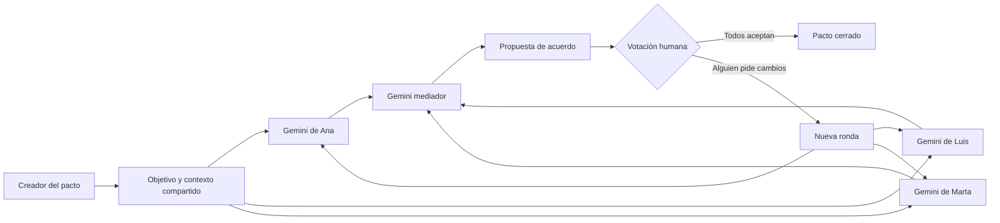

# Nexo Pact

**Agentes personales que negocian planes de grupo sin revelar las preferencias
privadas de sus propietarios.**

[Abrir web](https://nexo-pact.vercel.app/)
·
[Ver proyecto](https://henar-portafolio.vercel.app/)

Nexo Pact transforma una conversación interminable de grupo en una propuesta
concreta. Cada participante dispone de un agente Gemini independiente. Los
agentes preparan sus posiciones en paralelo y un mediador neutral busca un punto
de encuentro. Las personas conservan siempre la decisión final.

## Qué problema resuelve

Organizar una cena, una escapada, una reunión o una actividad suele exigir
intercambiar muchos mensajes sobre horarios, presupuesto, ubicación y
preferencias. Además, no todo el mundo quiere explicar públicamente los motivos
de cada restricción.

En Nexo Pact cada persona puede indicar:

- su disponibilidad;
- su presupuesto;
- sus preferencias;
- sus condiciones imprescindibles;
- notas que solo debe utilizar su agente.

El agente convierte ese perfil en la mínima posición pública necesaria para
negociar. El mediador nunca recibe las notas privadas originales.

## Flujo del MVP



1. El creador describe qué necesita acordar el grupo.
2. Configura entre dos y seis participantes.
3. Cada agente personal recibe únicamente el contexto común y el perfil privado
   de su propietario.
4. Los agentes personales se ejecutan en paralelo.
5. El servidor elimina cualquier dato privado y envía al mediador solo las
   posiciones públicas.
6. El mediador produce una propuesta estructurada.
7. Cada persona acepta o solicita cambios.
8. Si hay rechazos, los comentarios alimentan una nueva ronda, hasta un máximo
   de tres.

## Agentes

### Agente personal

Cada participante tiene una llamada independiente a Gemini con su propia
instrucción de sistema. Este agente:

- distingue requisitos de preferencias;
- protege las notas privadas;
- declara posibles concesiones;
- propone alternativas;
- evalúa la compatibilidad del pacto;
- no puede aceptar definitivamente en nombre de la persona.

### Mediador

El mediador recibe exclusivamente información pública. Su función es:

- tratar a todos los participantes con el mismo peso;
- respetar primero los requisitos imprescindibles;
- aprovechar las concesiones declaradas;
- explicar los compromisos;
- indicar qué información sigue pendiente;
- no inventar reservas, horarios, precios ni disponibilidad.

## Privacidad del MVP

“Privado” significa privado frente al resto de participantes y frente al agente
mediador. La información se envía al backend y a la API de Gemini para que el
agente personal pueda procesarla.

La interfaz actual permite que una persona configure todos los perfiles en el
mismo navegador para demostrar el sistema. La siguiente evolución del producto
deberá incorporar:

- cuentas de usuario;
- enlaces de invitación individuales;
- perfiles cifrados en una base de datos;
- permisos por participante;
- sesiones de agente independientes;
- caducidad y eliminación de pactos.

## Tecnologías

| Capa | Tecnología |
| --- | --- |
| Interfaz | React 18 y CSS |
| Backend | Vercel Functions sobre Node.js |
| IA | Gemini Interactions API |
| Modelo predeterminado | `gemini-3.5-flash` |
| Contratos de agentes | Structured outputs con JSON Schema |
| Paralelismo | `Promise.all()` para agentes personales |
| Despliegue | Vercel |
| Pruebas | Jest y React Testing Library |

## Arquitectura

```text
.
├── api/
│   ├── health.js             # Comprueba la configuración de Gemini
│   ├── negotiate.js          # Ejecuta agentes personales y mediación
│   └── _lib/
│       ├── gemini.js         # Cliente de Gemini Interactions API
│       └── schemas.js        # Esquemas de posiciones y propuestas
├── public/
│   ├── favicon.svg
│   ├── index.html
│   └── manifest.json
├── src/
│   ├── components/
│   │   ├── common/           # Elementos reutilizables de interfaz
│   │   ├── layout/           # Cabecera, portada y pie
│   │   ├── negotiation/      # Estados y resultados de la negociación
│   │   └── pact/             # Configuración del pacto y participantes
│   ├── data/demo.js          # Datos del ejemplo guiado
│   ├── hooks/                # Estado derivado y comprobación de Gemini
│   ├── services/api.js       # Cliente de la API del frontend
│   ├── utils/participants.js # Creación de participantes
│   ├── config.js             # Constantes compartidas
│   ├── App.js                # Estado y orquestación de la experiencia
│   ├── App.css               # Diseño responsive
│   ├── App.test.js           # Pruebas del flujo principal
│   ├── index.css
│   └── index.js
├── .env.example
└── package.json
```

## API

### `GET /api/health`

Devuelve si existe `GEMINI_API_KEY` y el modelo configurado.

### `POST /api/negotiate`

Ejecuta una ronda de negociación.

Ejemplo de entrada:

```json
{
  "topic": "Encontrar un sitio para cenar el viernes",
  "targetDate": "Viernes, entre las 20:30 y las 23:30",
  "area": "Madrid centro",
  "details": "Queremos llegar en transporte público",
  "round": 1,
  "participants": [
    {
      "id": "ana",
      "name": "Ana",
      "availability": "Desde las 20:30",
      "budget": "Hasta 25 €",
      "preferences": "Lugar tranquilo",
      "nonNegotiables": "Opciones vegetarianas",
      "privateNotes": "No quiere explicar por qué controla el presupuesto",
      "feedback": ""
    },
    {
      "id": "luis",
      "name": "Luis",
      "availability": "Desde las 21:00",
      "budget": "Hasta 35 €",
      "preferences": "Comida italiana",
      "nonNegotiables": "Volver en metro",
      "privateNotes": "",
      "feedback": ""
    }
  ],
  "previousProposal": null
}
```

La respuesta contiene:

- una posición pública por agente personal;
- el mensaje del mediador;
- una propuesta estructurada;
- puntuación orientativa de encaje;
- número de llamadas y modelo empleado.

## Límites y validación

- Entre dos y seis participantes.
- Máximo de tres rondas desde la interfaz.
- Identificadores de participante únicos.
- Límites de longitud para todos los campos.
- Catálogo cerrado de estados públicos.
- Respuestas de Gemini validadas mediante JSON Schema.
- La clave de Gemini nunca se envía al navegador.
- El mediador no recibe los perfiles privados.
- La persona, no el agente, aprueba el resultado final.

## Instalación local

### Requisitos

- Node.js 22 o 24 LTS;
- npm;
- Vercel CLI;
- una clave de Gemini.

### Configuración

```bash
npm install
```

Copia `.env.example` como `.env.local`:

```env
GEMINI_API_KEY=tu_clave_de_google_ai_studio
GEMINI_MODEL=gemini-3.5-flash
```

Inicia el entorno completo:

```bash
vercel dev
```

La aplicación estará disponible normalmente en
[http://localhost:3000](http://localhost:3000).

`npm start` solo inicia React y no sirve para ejecutar la negociación porque no
incluye las funciones de `api/`.

## Comandos

```bash
# Entorno completo
vercel dev

# Solo la interfaz
npm start

# Pruebas
npm test -- --watchAll=false

# Build de producción
npm run build
```

## Próximos pasos

1. Crear pactos persistentes en PostgreSQL.
2. Añadir autenticación e invitaciones privadas.
3. Guardar una sesión de Gemini por agente mediante `previous_interaction_id`.
4. Incorporar Google Calendar para disponibilidad autorizada.
5. Añadir Google Maps para propuestas de lugares verificables.
6. Crear grupos permanentes para parejas, familias y amigos.
7. Permitir pactos sobre viajes, tareas compartidas y reparto de gastos.
8. Añadir notificaciones y caducidad automática.

## Estado

Nexo Pact es un MVP funcional. La negociación utiliza instancias independientes
de Gemini para representar a cada participante y otra instancia para mediar. La
configuración multiusuario e invitaciones privadas está planteada como la
siguiente fase del producto.
